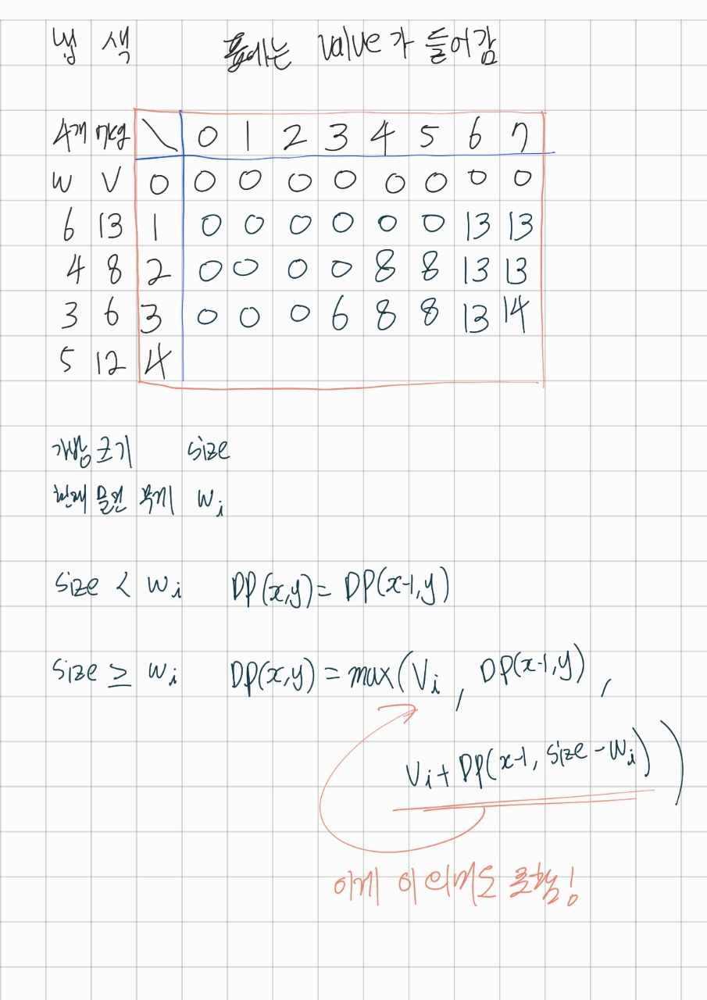

# 꼭 다시 풀어볼 것 220315.

# 평범한 배낭
## 유형 : 동적계획법 (DP) 냅색
* [12865](https://www.acmicpc.net/problem/12865) [:page_facing_up:](https://github.com/knemo333/TIL/blob/master/Algorithm/codes/12865.cpp)


### 문제
준서가 여행에 필요하다고 생각하는 N개의 물건이 있다. 각 물건은 무게 W와 가치 V를 가지는데, 해당 물건을 배낭에 넣어서 가면 준서가 V만큼 즐길 수 있다. 아직 행군을 해본 적이 없는 준서는 최대 K만큼의 무게만을 넣을 수 있는 배낭만 들고 다닐 수 있다. 준서가 최대한 즐거운 여행을 하기 위해 배낭에 넣을 수 있는 물건들의 가치의 최댓값을 알려주자.

#### 접근방법1
> 가치를 내림차순으로 정렬한 뒤 가치가 높은 순서대로 막 넣어서 최댓값을 구해봤는데 잘 안됐다.   
> 살짝 풀이를 봤는데 표를 이용하는 것 같다.   

##### 코드
```cpp
#include<iostream>
#include<vector>
#include<algorithm>
using namespace std;

bool compare(pair<int, int> a, pair<int, int> b) {
	if (a.first == b.first)
		return a.second < b.second;
	else {
		return a.first > b.first;
	}
}

int main() {
	int n, k;
	vector<pair<int, int>> things;
	vector<int> memo;
	cin >> n >> k;
	for (int i = 0; i < n; i++) {
		int temp_weight, temp_value;
		cin >> temp_weight >> temp_value;
		things.push_back(make_pair(temp_value, temp_weight));
	}
	sort(things.begin(), things.end(), compare);

	for (int i = 0; i < n; i++) {
		int weightAvailable = k;
		int valueSum = 0;
		for (int j = i; j < n; j++) {
			if (weightAvailable >= things[j].second) {
				weightAvailable -= things[j].second;
				valueSum += things[j].first;
			}
		}
		memo.push_back(valueSum);
	}

	cout << *max_element(memo.begin(), memo.end());
}
```

#### 접근방법2
> 이건 직접 배우자.   
> 표를 이용해서 문제를 한번 풀어봤고 그 표에 적용시킨 방법대로 점화식을 만들어 풀이.

   

##### 코드
```cpp
#include <iostream>
#include <vector>
#include <algorithm>
using namespace std;

int main() {
	int n, k;
	vector<pair<int, int>> things; //first == wegiht , second == value
	things.push_back(make_pair(-1, -1));
	int valueMemo[101][100001] = {0,};
	
	cin >> n >> k;
	
	for (int i = 0; i < n; i++) {
		int tempWeight, tempValue;
		cin >> tempWeight >> tempValue;
		things.push_back(make_pair(tempWeight, tempValue));
	}

	for (int i = 1; i <= n; i++) {
		for (int j = 1; j <= k; j++) {
			if (things[i].first > j)
				valueMemo[i][j] = valueMemo[i - 1][j];
			else {
				if (j - things[i].first > 0) {
					valueMemo[i][j] = max(things[i].second + valueMemo[i - 1][j - things[i].first], valueMemo[i - 1][j]);
				}
				else {
					valueMemo[i][j] = max(things[i].second, valueMemo[i - 1][j]);
				}
			}
		}
	}

	cout << valueMemo[n][k];

}
```

### 결론
모르는건 모르는 것.   
모를때 정답지를 보고 다음에 다시와서 푸는 것도 방법이다.   
공부란 혼자서 모든걸 깨우치는게 아니라 똑똑한사람이 만들어낸걸 익혀나가는 것부터 시작.